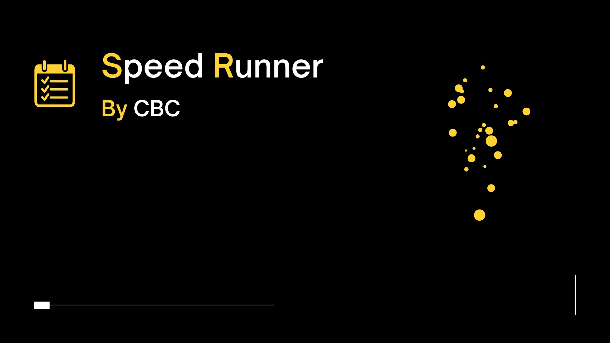
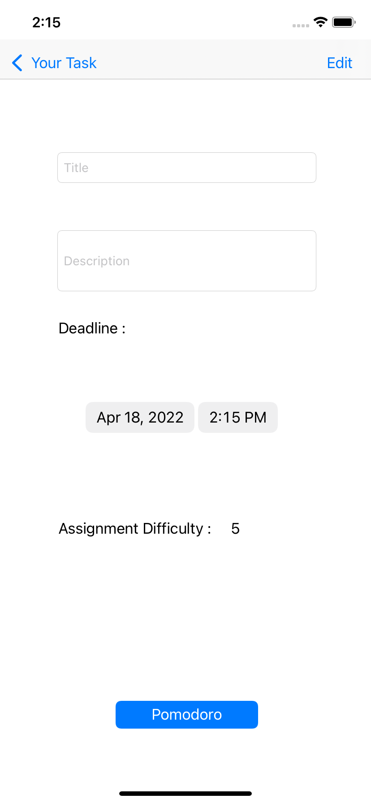

# Speed Runner
This repository was used for Mini Challenge 1 from the Apple Developer Academy Cohort 2022. My team and I conducted domain research for this project in order to develop an app statement, which was as follows:

*For **College students**
that help them to **organize their tasks by listing their existing tasks**, 
then **labeling it with several parameter to determine the priority** and using 
**the Pomodoro technique** to work on the selected task from the list that has been made before.*

  

Speed Runner is Lo-fi App by CBC.

## Project Members

- [Arnold Sidiprasetija](https://github.com/Arnolds18)
- Joseph William Santoso
- Sie Feng Yie Farrel
- Alfindi Abdillah Farizky
- Calvin Chandra Hidajat
- Yulibar Husni (as a mentor)

*notes : This repo made by me, because in this challenge we should doing individually so there are several representations from the app statement*
## Tech Stack

**Platform:** iOS

**Framework:** UIKit

**IDE:** XCode `v.13.3`

## Screenshots
Here are the screenshots from XCode Simulator

- First view when users open the app

- Users can add their new task

- Users can tap their task and see the title or descriptions also they can edit when there is a mistake.

- Last but not least, the pomodoro method to help users do their task

